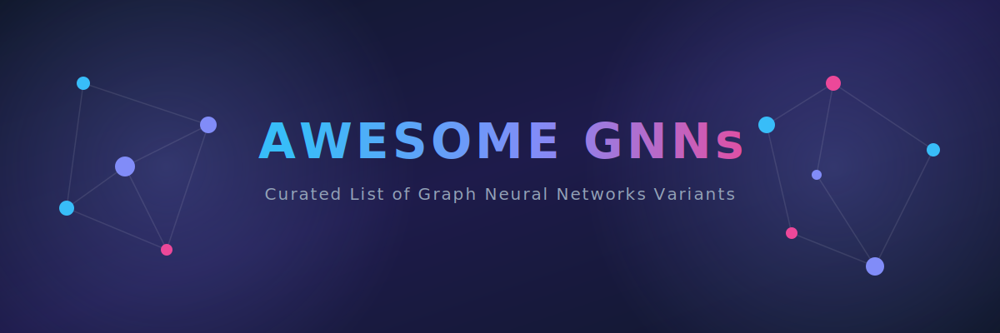

# 🚀 Awesome Graph Neural Networks

  

  
  
  
  
  

---

## 📖 Introduction to Graph Neural Network (GNN) Variants in AI

Graph Neural Networks (GNNs) are specialized deep learning architectures designed to process data structured as graphs (nodes, edges, and topologies). Depending on how information is aggregated across neighborhoods, structured sequentially, or scaled, several distinct variants exist.

---

## 🗺️ 1. Spatial/Message-Passing Variants

These foundational variants operate directly on the graph's spatial structure by aggregating localized neighborhood information.

| Variant | Key Characteristics | Year | First Paper |
| :--- | :--- | :---: | :--- |
| **[Graph Convolutional Networks (GCN)](./details/gcn.md)** | • Applies a localized first-order approximation of spectral graph convolutions. • *Mechanism:* Updates a node's representation by taking a localized isotropic average of its neighbors' features. | 2016 | [Kipf & Welling (2016)](https://arxiv.org/abs/1609.02907) |
| **[Graph Attention Networks (GAT)](./details/gat.md)** | • Introduces anisotropic operations using self-attention mechanisms over neighbor nodes. • *Pros:* Allows the model to dynamically assign different weights (importance) to different neighbors. | 2017 | [Veličković et al. (2017)](https://arxiv.org/abs/1710.10903) |
| **[GraphSAGE (Sample and Aggregate)](./details/graphsage.md)** | • An inductive framework that samples a fixed-size local neighborhood instead of using all neighbors. • *Pros:* Scales efficiently to massive graphs and generalizes seamlessly to entirely unseen nodes. | 2017 | [Hamilton et al. (2017)](https://arxiv.org/abs/1706.02216) |
| **[Graph Isomorphism Networks (GIN)](./details/gin.md)** | • Adjusts the aggregation step using a highly injective sum-aggregator function. • *Significance:* Achieves maximum discriminative power, theoretically matching the Weisfeiler-Lehman (1-WL) graph isomorphism test. | 2018 | [Xu et al. (2018)](https://arxiv.org/abs/1810.00826) |

---

## 🎚️ 2. Spectral-Domain Variants

These variants approach graph convolutions through the lens of graph signal processing, utilizing the Laplacian matrix.

| Variant | Key Characteristics | Year | First Paper |
| :--- | :--- | :---: | :--- |
| **[Spectral GCN (Bruna et al.)](./details/spectral_gcn.md)** | • Computes convolutions in the Fourier domain using the graph Laplacian eigendecomposition. • *Cons:* Computationally expensive ($O(N^3)$ complexity) and non-localized. | 2013 | [Bruna et al. (2013)](https://arxiv.org/abs/1312.6203) |
| **[ChebNet](./details/chebnet.md)** | • Truncates spectral convolutions using Chebychev polynomials. • *Pros:* Avoids explicit eigendecomposition, reducing complexity to linear scaling with the number of edges. | 2016 | [Defferrard et al. (2016)](https://arxiv.org/abs/1606.09375) |

---

## ⏳ 3. Temporal & Sequential Variants

These architectures are designed for dynamic graphs where the topology, node features, or edge properties change over time.

| Variant | Key Characteristics | Year | First Paper |
| :--- | :--- | :---: | :--- |
| **[Dynamic Graph Neural Networks (DGNN)](./details/dgnn.md)** | • Models graphs that evolve continuously by updating node states as new edges appear chronologically. | 2020 | [Rossi et al. (2020)](https://arxiv.org/abs/2006.10637) |
| **[Graph Recurrent Neural Networks (GNN + RNN / GraphLSTM)](./details/graph_rnn.md)** | • Combines structural message passing with recurrent cells (LSTM/GRU). • *Use Case:* Predicting traffic flows, cellular movements, or evolving social network interactions. | 2016 | [Seo et al. (2016)](https://arxiv.org/abs/1612.07659) |

---

## 🔬 4. Advanced Geometric & Scale-Invariant Variants

These specialized architectures solve specific deep learning limitations like over-smoothing, scalability, or complex spatial geometries.

| Variant | Key Characteristics | Year | First Paper |
| :--- | :--- | :---: | :--- |
| **[Heterogeneous Graph Neural Networks (HGNN)](./details/heterogeneous_gnn.md)** | • Designed for graphs containing multiple distinct types of nodes and edges (e.g., User, Product, Brand). • *Mechanism:* Uses meta-paths to aggregate distinct relational semantics separately. | 2019 | [Wang et al. (2019)](https://arxiv.org/abs/1903.07293) |
| **[Cluster-GCN / NodeMinibatch](./details/cluster_gcn.md)** | • Partitions the graph into tightly clustered subgraphs using clustering algorithms before applying convolutions. • *Pros:* Eliminates the "neighborhood explosion" problem, allowing deep training on giant commercial graphs. | 2019 | [Chiang et al. (2019)](https://arxiv.org/abs/1905.07953) |
| **[Hypergraph Neural Networks (HGNN)](./details/hypergraph_gnn.md)** | • Generalizes standard edges to hyperedges that can connect more than two nodes simultaneously. • *Use Case:* Modeling complex, multi-entity group interactions or complex biochemical pathways. | 2019 | [Feng et al. (2019)](https://arxiv.org/abs/1809.09401) |

---

## 📈 Star History

<a href="https://www.star-history.com/?repos=ishandutta2007%2FAwesome-Graph-Neural-Networks&type=date&legend=bottom-right">
<picture>
<source media="(prefers-color-scheme: dark)" srcset="https://api.star-history.com/chart?repos=ishandutta2007/Awesome-Graph-Neural-Networks&type=date&theme=dark&legend=bottom-right" />
<source media="(prefers-color-scheme: light)" srcset="https://api.star-history.com/chart?repos=ishandutta2007/Awesome-Graph-Neural-Networks&type=date&legend=bottom-right" />

</picture>
</a>

