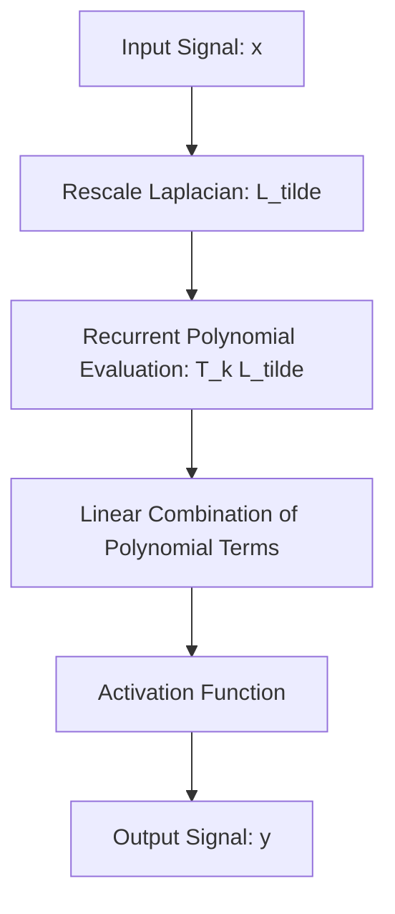

# ChebNet

ChebNet (Chebyshev Spectral CNN) is a localized spectral-domain variant that avoids explicit eigendecomposition of the graph Laplacian by using Chebyshev polynomial expansion.

## 📌 Architecture & Mechanism
ChebNet approximates the spectral convolution filter using a truncated expansion of Chebyshev polynomials up to order $K$. This restricts the convolution to $K$-hop neighborhoods, achieving localized filtering and reducing complexity to linear scaling with the number of edges.

## 🧮 Mathematical Formulation
The spectral filter $g_\theta$ is approximated as:

$$g_\theta \star x \approx \sum_{k=0}^K \theta_k T_k(\tilde{L}) x$$

Where:
- $\tilde{L} = \frac{2}{\lambda_{\text{max}}} L - I_N$ is the rescaled Laplacian.
- $\lambda_{\text{max}}$ is the largest eigenvalue of the Laplacian $L$.
- $\theta_k \in \mathbb{R}^K$ is a vector of Chebyshev coefficients.
- $T_k(y)$ is the Chebyshev polynomial of order $k$, evaluated recursively as:
  $$T_k(y) = 2 y T_{k-1}(y) - T_{k-2}(y) \quad \text{with} \quad T_0(y) = 1, \; T_1(y) = y$$

## ⚖️ Pros & Cons
*   **Pros:**
    *   Avoids expensive eigendecomposition, reducing complexity to $O(K \|E\|)$.
    *   Guarantees localized convolutions within $K$-hop neighborhoods.
    *   More stable during training than raw spectral convolution models.
*   **Cons:**
    *   Still depends on the largest eigenvalue ($\lambda_{\text{max}}$), which can be expensive to calculate for dynamically changing graphs.
    *   Mainly suitable for static graph structures.

[↩ Back to README](../README.md)
