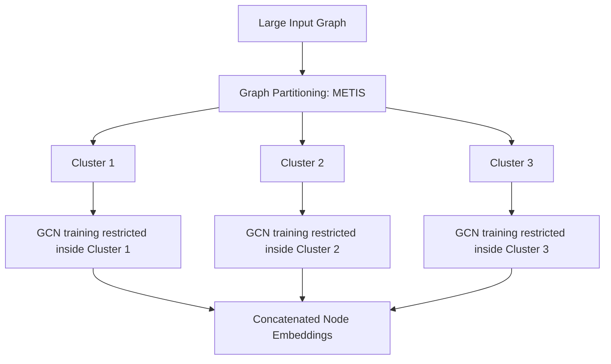

# Cluster-GCN

Cluster-GCN is an efficient training algorithm designed to scale Graph Convolutional Networks (GCNs) to massive graphs by clustering nodes and training on subgraphs.

## 📌 Architecture & Mechanism
Traditional mini-batch methods suffer from "neighborhood explosion" where the number of neighbors grows exponentially with layer depth. Cluster-GCN partitions the graph into tightly clustered subgraphs using partitioning algorithms (like METIS) and restricts GCN convolutions to stay within each cluster during a training step.

## 🧮 Mathematical Formulation
Let the graph be partitioned into $M$ clusters. For a cluster $c$, let $A_{cc}$ be the sub-adjacency matrix containing only intra-cluster edges. The GCN propagation rule inside cluster $c$ is restricted to:

$$H_{c}^{(l+1)} = \sigma \left( \tilde{D}_{cc}^{-\frac{1}{2}} \tilde{A}_{cc} \tilde{D}_{cc}^{-\frac{1}{2}} H_{c}^{(l)} W^{(l)} \right)$$

Where:
- $\tilde{A}_{cc} = A_{cc} + I$ is the sub-adjacency matrix with self-loops.
- $\tilde{D}_{cc}$ is the diagonal degree matrix of $\tilde{A}_{cc}$.
- This removes the inter-cluster dependencies during backpropagation, keeping memory overhead constant per batch.

## ⚖️ Pros & Cons
*   **Pros:**
    *   Eliminates neighborhood expansion, allowing training of very deep GCNs.
    *   Significantly reduces memory footprint, enabling training on millions of nodes.
    *   Provides high training speedups.
*   **Cons:**
    *   Discarding inter-cluster edges during training might lead to loss of cross-cluster structural info.
    *   Performance depends heavily on the quality of the clustering algorithm.

[↩ Back to README](../README.md)
