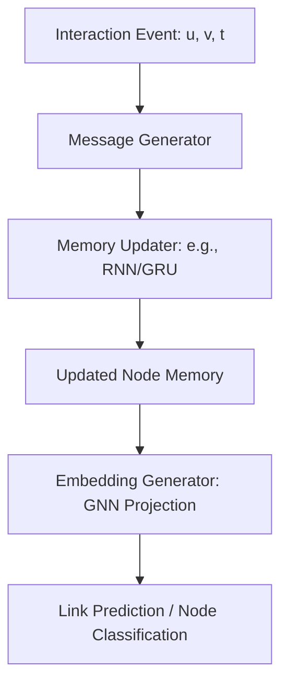

# Dynamic Graph Neural Networks (DGNN)

Dynamic Graph Neural Networks (DGNNs) are designed for graphs that change dynamically over time (e.g., node additions, edge connections, attribute changes).

## 📌 Architecture & Mechanism
DGNNs typically model dynamic systems as a stream of events. When an event occurs (e.g., a new edge is formed at time $t$), the memory or state vectors of the involved nodes are updated incrementally.

## 🧮 Mathematical Formulation
In a continuous-time framework (like Temporal Graph Networks - TGN):
1.  **Message Generation:**
    $$m_i(t) = \text{msg}(s_i(t^-), s_j(t^-), \Delta t, e_{ij}(t))$$
2.  **Memory Update:**
    $$s_i(t) = \text{mem}(m_i(t), s_i(t^-))$$
3.  **Embedding Generation:**
    $$z_i(t) = \sum_{j \in \mathcal{N}_i(t)} \alpha_{ij} W s_j(t)$$

Where:
- $s_i(t)$ is the memory (hidden state) of node $i$ at time $t$.
- $e_{ij}(t)$ is the feature of the edge between $i$ and $j$ created at time $t$.
- $\text{mem}$ is an RNN or GRU cell.
- $z_i(t)$ is the dynamic embedding used for downstream tasks.

## ⚖️ Pros & Cons
*   **Pros:**
    *   Models continuous-time evolution and precise interaction timestamps.
    *   Saves computation by performing incremental updates rather than full graph re-computation.
    *   Essential for real-world domains like fraud detection and transaction systems.
*   **Cons:**
    *   High memory footprint to store historical states for all nodes.
    *   Sequential dependencies make parallelization across time challenging.

[↩ Back to README](../README.md)
