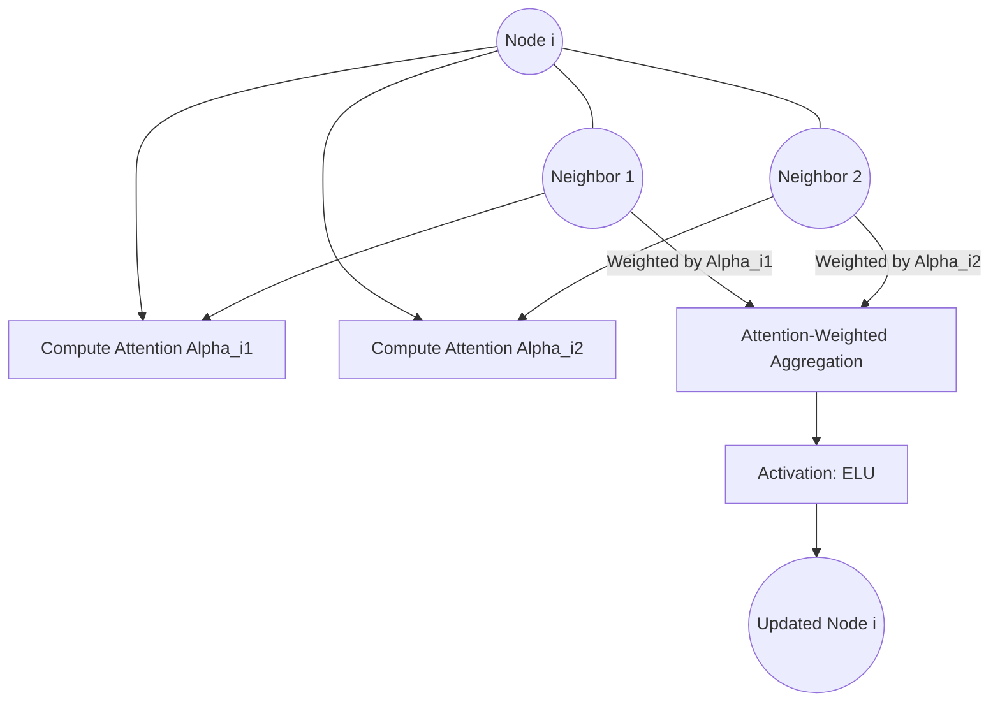

# Graph Attention Networks (GAT)

Graph Attention Networks (GAT) incorporate attention-based mechanisms into graph structures. Instead of using predefined normalized weights like GCN, GAT allows nodes to dynamically assign varying importance to different neighbors.

## 📌 Architecture & Mechanism
GAT computes hidden representations of nodes by attending to their neighbors using a self-attention mechanism. Multi-head attention is typically employed to stabilize the learning process and enrich representation capacities.

## 🧮 Mathematical Formulation
The attention coefficient $\alpha_{ij}$ measuring the importance of node $j$ to node $i$:

$$\alpha_{ij} = \frac{\exp\left(\text{LeakyReLU}\left(\mathbf{a}^T [W h_i \| W h_j]\right)\right)}{\sum_{k \in \mathcal{N}_i} \exp\left(\text{LeakyReLU}\left(\mathbf{a}^T [W h_i \| W h_k]\right)\right)}$$

For multi-head attention (with $K$ heads), the node representation is concatenated:

$$h_i^{(l+1)} = \Vert_{k=1}^K \sigma\left(\sum_{j \in \mathcal{N}_i} \alpha_{ij}^k W^k h_j^{(l)}\right)$$

Where:
- $h_i$ and $h_j$ are features of node $i$ and $j$.
- $W$ is a shared weight projection matrix.
- $\mathbf{a}$ is a parameterized feed-forward attention layer.
- $\Vert$ represents concatenation.

## ⚖️ Pros & Cons
*   **Pros:**
    *   Anisotropic aggregation allows the network to learn which neighbors are more important.
    *   Completely local operations enable efficient execution in parallel.
    *   Applicable to inductive learning tasks on completely unseen graphs.
*   **Cons:**
    *   High memory consumption due to the storage of attention coefficients.
    *   Slower training compared to static aggregation models like GCN.

[↩ Back to README](../README.md)
