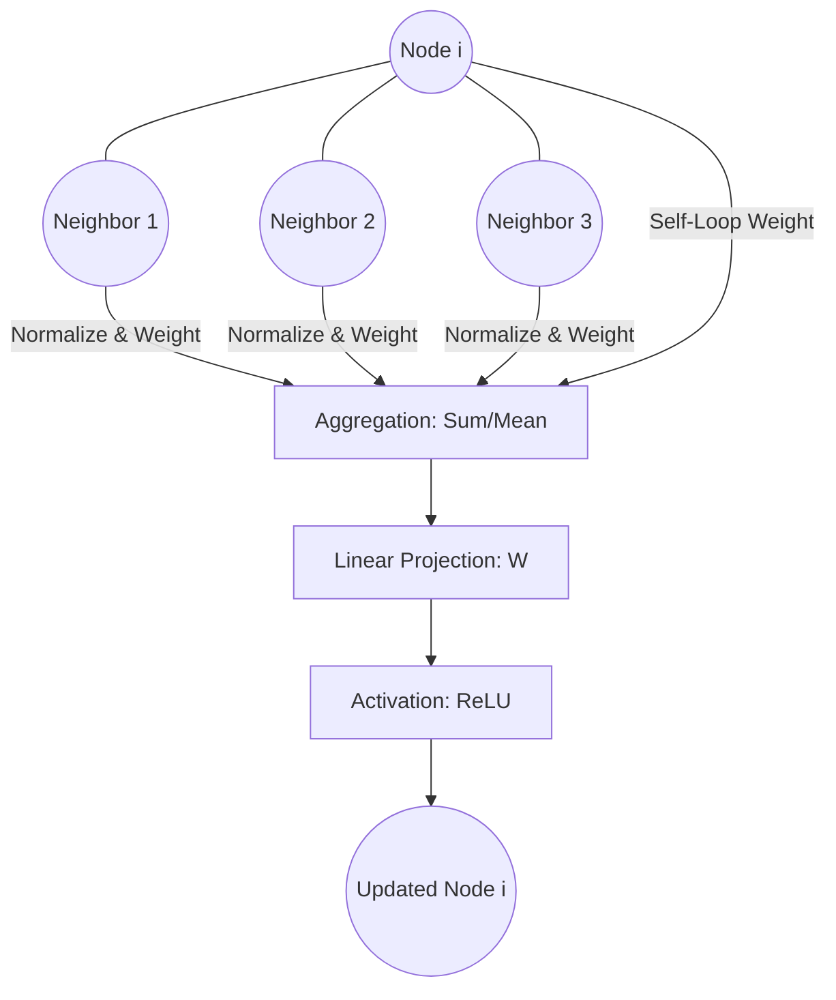

# Graph Convolutional Networks (GCN)

Graph Convolutional Networks (GCN) are foundational deep learning architectures designed for semi-supervised learning on graph-structured data. They generalize the operation of convolution from grid-like structures (like images) to general graphs.

## 📌 Architecture & Mechanism
GCNs update node representations by performing a localized first-order approximation of spectral graph convolutions. Each node aggregates features from its immediate neighbors and itself, applying a shared parameter matrix and an activation function.

## 🧮 Mathematical Formulation
The layer-wise propagation rule of a multi-layer GCN is:

$$H^{(l+1)} = \sigma \left( \tilde{D}^{-\frac{1}{2}} \tilde{A} \tilde{D}^{-\frac{1}{2}} H^{(l)} W^{(l)} \right)$$

Where:
- $\tilde{A} = A + I_N$ is the adjacency matrix of the graph with added self-loops.
- $\tilde{D}$ is the diagonal degree matrix of $\tilde{A}$ where $\tilde{D}_{ii} = \sum_j \tilde{A}_{ij}$.
- $W^{(l)}$ is a layer-specific trainable weight matrix.
- $\sigma$ is an activation function (e.g., ReLU).
- $H^{(l)}$ is the matrix of activations in the $l$-th layer ($H^{(0)} = X$, the input node features).

## ⚖️ Pros & Cons
*   **Pros:**
    *   Highly effective for semi-supervised classification tasks.
    *   Computationally efficient compared to full spectral convolutions ($O(\|E\|)$ instead of $O(N^3)$).
    *   Incorporate both node features and structural topology.
*   **Cons:**
    *   Suffer from *over-smoothing* when multiple layers are stacked (typically limited to 2-3 layers).
    *   Isotropic aggregation: treats all neighbors with equal structural weight.
    *   Cannot scale easily to extremely large graphs without batching.

[↩ Back to README](../README.md)
