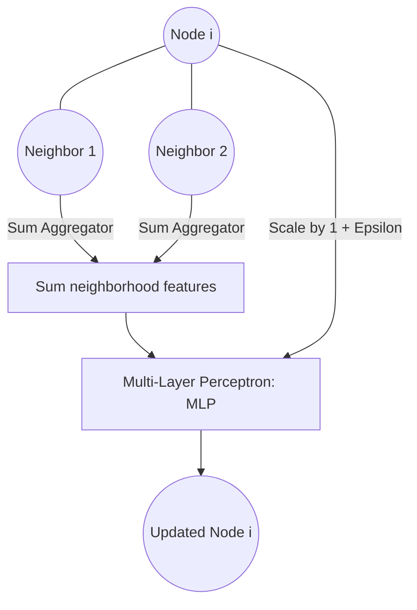

# Graph Isomorphism Networks (GIN)

Graph Isomorphism Networks (GIN) are highly discriminative GNN architectures designed to maximize graph classification power. They are theoretically proven to be as powerful as the Weisfeiler-Lehman (1-WL) graph isomorphism test.

## 📌 Architecture & Mechanism
GIN updates node representations using a sum-aggregator and multi-layer perceptrons (MLP). The sum-aggregator is injective, meaning it maps distinct neighborhoods to distinct representations, preserving graph isomorphism properties.

## 🧮 Mathematical Formulation
The GIN node update formulation is defined as:

$$h_v^{(l+1)} = \text{MLP}^{(l)} \left( \left( 1 + \epsilon^{(l)} \right) h_v^{(l)} + \sum_{u \in \mathcal{N}(v)} h_u^{(l)} \right)$$

Where:
- $\epsilon$ is a learnable parameter or a fixed scalar.
- $\text{MLP}$ is a multi-layer perceptron.
- The summation aggregator guarantees that the structure's multiset of features is mapped injectively.

## ⚖️ Pros & Cons
*   **Pros:**
    *   Maximum discriminative power for distinguishing graph structures.
    *   Strong theoretical foundations mapped directly to the 1-WL isomorphism test.
    *   Excellent performance on graph-level classification tasks.
*   **Cons:**
    *   Can overfit easily on node-level classification tasks due to high expressive power.
    *   More sensitive to parameter initialization ($\epsilon$).

[↩ Back to README](../README.md)
