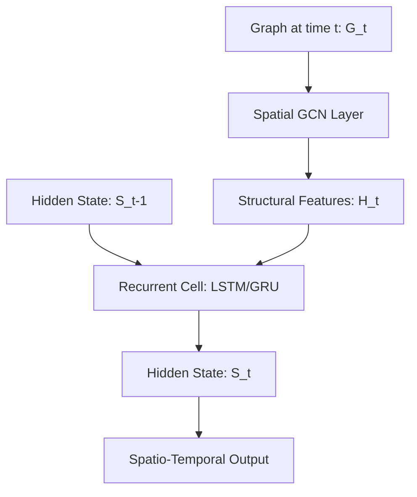

# Graph Recurrent Neural Networks (GNN + RNN / GraphLSTM)

Graph Recurrent Neural Networks combine spatial graph convolutions with recurrent cells (like LSTM or GRU) to model spatio-temporal dependencies.

## 📌 Architecture & Mechanism
These architectures process sequences of graph structures. At each time step, structural information is aggregated using a spatial GNN layer, and the temporal patterns are captured by passing the aggregated features into a recurrent unit.

## 🧮 Mathematical Formulation
In a Graph Convolutional Recurrent Network (GCRN):

$$H^{(t)} = \text{GCN}\left(X^{(t)}, A^{(t)}\right)$$

$$S^{(t)} = \text{LSTM}\left(H^{(t)}, S^{(t-1)}\right)$$

Where:
- $X^{(t)}$ and $A^{(t)}$ are the node feature matrix and adjacency matrix at time $t$.
- $H^{(t)}$ represents the spatial structural features extracted at time $t$.
- $S^{(t)}$ represents the hidden state of the LSTM at time $t$.

## ⚖️ Pros & Cons
*   **Pros:**
    *   Simultaneously models spatial topologies and temporal sequences.
    *   Well-suited for forecasting tasks on fixed graph topologies (e.g., sensor networks).
*   **Cons:**
    *   Highly computationally expensive due to joint GNN and recurrent operations over multiple steps.
    *   Difficult to scale to long sequence lengths due to vanishing/exploding gradients in RNNs.

[↩ Back to README](../README.md)
