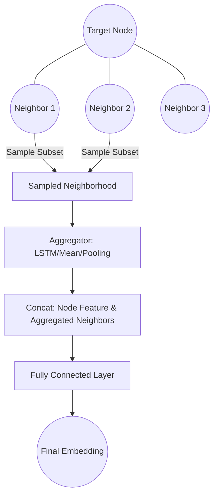

# GraphSAGE (Sample and Aggregate)

GraphSAGE is a general inductive framework that leverages node feature information to efficiently generate node embeddings for previously unseen data.

## 📌 Architecture & Mechanism
Instead of training individual embeddings for each node, GraphSAGE trains a set of aggregator functions that learn to aggregate feature information from a node's local neighborhood. To scale to large graphs, GraphSAGE samples a fixed-size set of neighbors instead of using the entire neighborhood.

## 🧮 Mathematical Formulation
For a node $v$, its representation $h_v^{(l+1)}$ at layer $l+1$ is updated as:

$$h_{\mathcal{N}(v)}^{(l+1)} = \text{AGGREGATE}_{l+1} \left( \left\{ h_u^{(l)}, \forall u \in \mathcal{N}(v) \right\} \right)$$

$$h_v^{(l+1)} = \sigma \left( W^{(l+1)} \cdot \left[ h_v^{(l)} \,\|\, h_{\mathcal{N}(v)}^{(l+1)} \right] \right)$$

Common aggregators include:
1.  **Mean Aggregator:** Element-wise average of neighbor vectors.
2.  **LSTM Aggregator:** Higher capacity, but non-symmetric (requires random ordering).
3.  **Pooling Aggregator:** Symmetric max-pooling over fully connected layers.

## ⚖️ Pros & Cons
*   **Pros:**
    *   Highly scalable to massive web-scale graphs through neighborhood sampling.
    *   Inductive capability allows it to generalize to completely unseen nodes.
    *   Flexibility in choosing different aggregator architectures.
*   **Cons:**
    *   Sampling can lead to loss of information from discarded neighbors.
    *   Sub-optimal representations if the chosen sample size is too small.

[↩ Back to README](../README.md)
