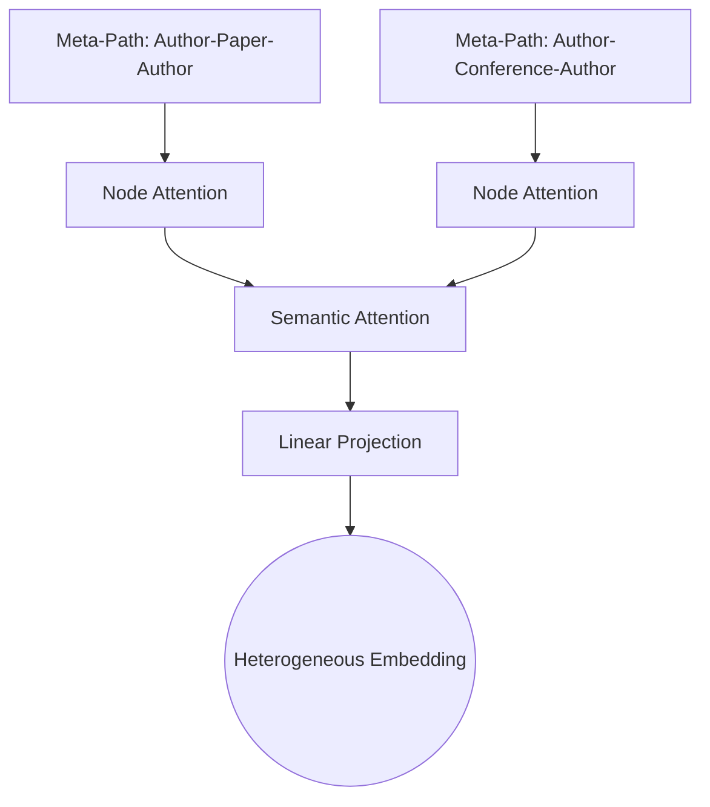

# Heterogeneous Graph Neural Networks (HGNN)

Heterogeneous Graph Neural Networks are designed to learn representations from graphs containing multiple types of nodes and edges (relations).

## 📌 Architecture & Mechanism
HGNNs use meta-paths (sequences of node and edge types) to aggregate relational semantics separately. They typically employ a hierarchical attention mechanism: node-level attention to aggregate features from neighbors within a specific meta-path, and semantic-level attention to merge information from different meta-paths.

## 🧮 Mathematical Formulation
For a node $i$ under a meta-path $\Phi$:
1.  **Node-Level Aggregation:**
    $$z_i^{\Phi} = \sigma \left( \sum_{j \in \mathcal{N}_i^{\Phi}} \alpha_{ij}^{\Phi} \cdot W_{\Phi} h_j \right)$$
2.  **Semantic-Level Aggregation:**
    $$\beta_{\Phi} = \text{softmax}\left(\text{SemanticScore}(\{z_i^{\Phi}\})\right)$$
    $$z_i = \sum_{\Phi} \beta_{\Phi} \cdot z_i^{\Phi}$$

Where:
- $z_i^{\Phi}$ is the meta-path-specific embedding for node $i$.
- $\alpha_{ij}^{\Phi}$ is the node-level attention weight under meta-path $\Phi$.
- $\beta_{\Phi}$ is the semantic-level attention weight measuring the importance of meta-path $\Phi$.
- $z_i$ is the final aggregated heterogeneous embedding.

## ⚖️ Pros & Cons
*   **Pros:**
    *   Preserves rich semantic information from heterogeneous relations.
    *   High flexibility to define custom meta-paths representing specific domain schemas.
*   **Cons:**
    *   Defining optimal meta-paths requires significant domain expertise.
    *   High computational complexity due to multiple parallel aggregation channels.

[↩ Back to README](../README.md)
