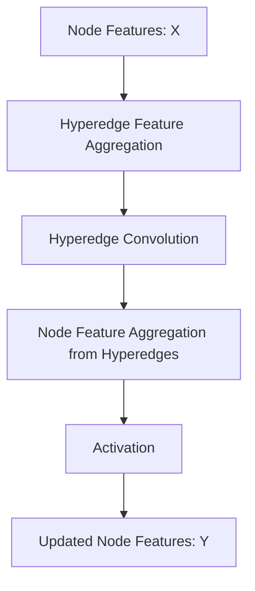

# Hypergraph Neural Networks (HGNN)

Hypergraph Neural Networks generalize standard graph neural networks by modeling high-order data correlations using hypergraphs, where an edge can connect multiple nodes simultaneously.

## 📌 Architecture & Mechanism
In a hypergraph, a hyperedge can group any number of nodes. The convolution process on a hypergraph is split into two steps: propagating information from nodes to their shared hyperedges, and then propagating information from hyperedges back to the nodes.

## 🧮 Mathematical Formulation
The hypergraph convolution layer propagation rule is:

$$X^{(l+1)} = \sigma \left( D_v^{-1} H W D_e^{-1} H^T X^{(l)} \Theta^{(l)} \right)$$

Where:
- $H \in \{0, 1\}^{N \times M}$ is the incidence matrix representing node-hyperedge connections.
- $D_v \in \mathbb{R}^{N \times N}$ is the diagonal node degree matrix.
- $D_e \in \mathbb{R}^{M \times M}$ is the diagonal hyperedge degree matrix.
- $W \in \mathbb{R}^{M \times M}$ is the diagonal matrix representing hyperedge weights.
- $\Theta^{(l)}$ is a trainable weight matrix at layer $l$.
- $\sigma$ is an activation function.

## ⚖️ Pros & Cons
*   **Pros:**
    *   Captures complex multi-entity correlations (beyond simple pairwise edges).
    *   Highly effective for modeling group interactions, biochemical pathways, or co-authorship networks.
*   **Cons:**
    *   Creating and updating the incidence matrix $H$ is memory-intensive.
    *   Higher computational complexity than pairwise GNNs.

[↩ Back to README](../README.md)
