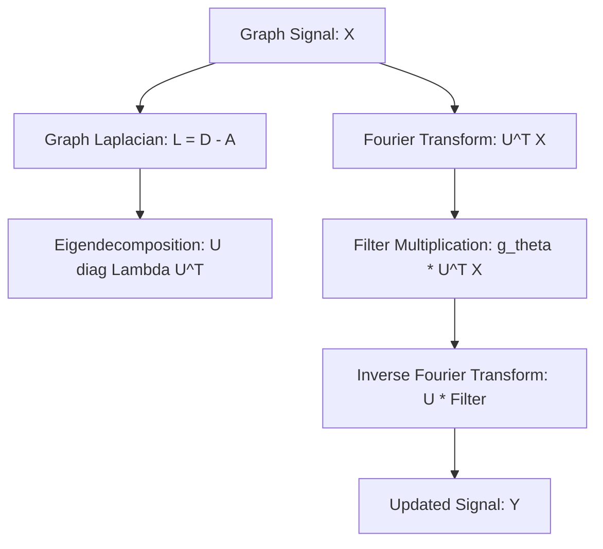

# Spectral Graph Convolutional Networks (Spectral GCN)

Spectral Graph Convolutional Networks define convolutions in the spectral domain (Fourier domain) using the graph Laplacian matrix and its eigendecomposition.

## 📌 Architecture & Mechanism
These architectures compute filters based on the eigenvalues and eigenvectors of the graph Laplacian. Since the Fourier basis depends on the graph structure, the learned filters cannot be easily transferred to graphs with different structures.

## 🧮 Mathematical Formulation
The convolution of a graph signal $x \in \mathbb{R}^N$ with a filter $g_\theta$ parameterized by $\theta \in \mathbb{R}^N$ in the Fourier domain is:

$$g_\theta \star x = U g_\theta(\Lambda) U^T x$$

Where:
- $L = I_N - D^{-\frac{1}{2}} A D^{-\frac{1}{2}} = U \Lambda U^T$ is the normalized graph Laplacian.
- $U$ is the matrix of orthonormal eigenvectors of $L$.
- $\Lambda$ is the diagonal matrix of eigenvalues.
- $g_\theta(\Lambda)$ is a diagonal matrix containing the filter coefficients.

## ⚖️ Pros & Cons
*   **Pros:**
    *   Mathematically rigorous formulation based on Spectral Graph Theory.
    *   Captures global structural dynamics of the graph.
*   **Cons:**
    *   High computational complexity of $O(N^3)$ due to the eigendecomposition of the Laplacian matrix.
    *   Non-localized filters: updating a node requires global graph information.
    *   Transductive only: filters are tightly coupled to the specific graph topology and cannot generalize to new graphs.

[↩ Back to README](../README.md)
